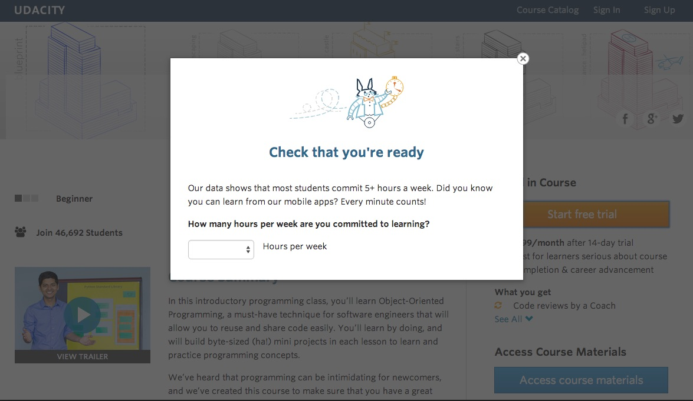

# 0. Experiment Overview: Free Trial Screener

At the time of this experiment, Udacity courses currently have two options on the course overview page: "start free trial", and "access course materials". If the student clicks "start free trial", they will be asked to enter their credit card information, and then they will be enrolled in a free trial for the paid version of the course. After 14 days, they will automatically be charged unless they cancel first. If the student clicks "access course materials", they will be able to view the videos and take the quizzes for free, but they will not receive coaching support or a verified certificate, and they will not submit their final project for feedback.  

In the experiment, Udacity tested a change where if the student clicked "start free trial", they were asked how much time they had available to devote to the course. If the student indicated 5 or more hours per week, they would be taken through the checkout process as usual. If they indicated fewer than 5 hours per week, a message would appear indicating that Udacity courses usually require a greater time commitment for successful completion, and suggesting that the student might like to access the course materials for free. At this point, the student would have the option to continue enrolling in the free trial, or access the course materials for free instead. This [screenshot](https://drive.google.com/file/d/0ByAfiG8HpNUMakVrS0s4cGN2TjQ/view) shows what the experiment looks like. Some [baseline](https://docs.google.com/spreadsheets/d/1MYNUtC47Pg8hdoCjOXaHqF-thheGpUshrFA21BAJnNc/edit#gid=0) values was provided in this spreedsheet.

</img>

The hypothesis was that this might set clearer expectations for students upfront, thus reducing the number of frustrated students who left the free trial because they didn't have enough time—without significantly reducing the number of students to continue past the free trial and eventually complete the course. If this hypothesis held true, Udacity could improve the overall student experience and improve coaches' capacity to support students who are likely to complete the course.  

The unit of diversion is a cookie, although if the student enrolls in the free trial, they are tracked by user-id from that point forward. The same user-id cannot enroll in the free trial twice. For users that do not enroll, their user-id is not tracked in the experiment, even if they were signed in when they visited the course overview page.  

# 1. Metric Choice

## 1.1 Instruction

Which of the following metrics would you choose to measure for this experiment and why? For each metric you choose, indicate whether you would use it as an invariant metric or an evaluation metric. The practical significance boundary for each metric, that is, the difference that would have to be observed before that was a meaningful change for the business, is given in parentheses. All practical significance boundaries are given as absolute changes.
Any place "unique cookies" are mentioned, the uniqueness is determined by day. (That is, the same cookie visiting on different days would be counted twice.) User-ids are automatically unique since the site does not allow the same user-id to enroll twice.   

Any place "unique cookies" are mentioned, the uniqueness is determined by day. (That is, the same cookie visiting on different days would be counted twice.) User-ids are automatically unique since the site does not allow the same user-id to enroll twice.  

+ _Number of cookies_: That is, number of unique cookies to view the course overview page. **(dmin=3000)**
+ _Number of user-ids_: That is, number of users who enroll in the free trial. **(dmin=50)**
+ _Number of clicks_: That is, number of unique cookies to click the "Start free trial" button (which happens before the free trial screener is trigger). **(dmin=240)**
+ _Click-through-probability_: That is, number of unique cookies to click the "Start free trial" button divided by number of unique cookies to view the course overview page. **(dmin=0.01)**
+ _Gross conversion_: That is, number of user-ids to complete checkout and enroll in the free trial divided by number of unique cookies to click the "Start free trial" button. **(dmin= 0.01)**
+ _Retention_: That is, number of user-ids to remain enrolled past the 14-day boundary (and thus make at least one payment) divided by number of user-ids to complete checkout. **(dmin=0.01)**
+ _Net conversion_: That is, number of user-ids to remain enrolled past the 14-day boundary (and thus make at least one payment) divided by the number of unique cookies to click the "Start free trial" button. **(dmin= 0.0075)**
  
You should also decide now what results you will be looking for in order to launch the experiment. Would a change in any one of your evaluation metrics be sufficient? Would you want to see multiple metrics all move or not move at the same time in order to launch? This decision will inform your choices while designing the experiment.  

## 1.2 Answer

Here is the overall view of user path:

</img>

Base on the flow chart above, it is clear that we should use the following **invariant variables** and **evaluation metrics**. 

### 1.2.1 Invariant Variables

+ **Number of cookies**: this metric should not be affected by the experiment we run, since the experiment will be running between Free trail stage and Enrollment stage, therefore we should keep the variables before the enrollment satge as the same as possible for controal and experiment group.
+ **Number of clicks**: this metric also should not be affected by the experiment, the reason is the same.
+ **Click-through-probability**: this metric also should not be affected by the experiment, the reason is the same.

### 1.2.2 Evaluation metrics

+ **Gross conversion**: this metric can be affected since the students in the experiment group will be asked about how much time they can devote in this course, if the answer is less than 5 hours, they will be suggested learning from free material rather than starting this free trail, as a result, the enrollment page will not be shown and the nominator of this metric will be affected.
+ **Retention**: this metric can also be affected because of the same reason mentioned above, to be specific, both the numerator and denominator should have difference between control group and experiment gtoup. 
+ **Net conversion**: this metric can also be affected because of the same reason mentioned above, to be specific, the numerator will be afftected in the experiment group.  

To summarize, the goals of this experiment are:

1. Number of the payments should not decrease.
2. Number of students who do not have enough time should decrease.

By having the goals above, our Evaluation metrics should:

1. Gross conversion: decrease
2. Retention: increase
3. Net conversion: remain the same or increase

### 1.2.3 Standard Deviation of Evaluation metrics

1. Gross conversion (binorm std)

# References

+ [Project Instruction](https://docs.google.com/document/u/1/d/1aCquhIqsUApgsxQ8-SQBAigFDcfWVVohLEXcV6jWbdI/pub?embedded=True)
+ [Baseline Values](https://docs.google.com/spreadsheets/d/1MYNUtC47Pg8hdoCjOXaHqF-thheGpUshrFA21BAJnNc/edit#gid=0)

